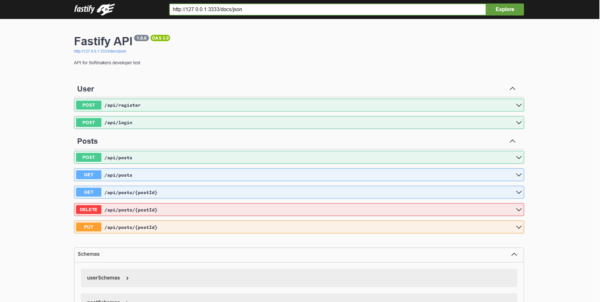

# Server



## Technologies

- Fastify
- Eslint + Prettier
- TapJS (for testing)
- Prisma ORM
- PostgresSQL
- Typescript

## Database Docker setup

1. Initialize the Docker container with a Postgres database

```
yarn database:start
```

2. Execute the Prisma Migration:

```
yarn prisma migrate dev --name init
```

## Available Commands

#### Run Development Server

```
yarn dev
```

#### Linter

```
yarn lint
```

```
yarn lint:fix
```

#### Styles

```
yarn style
```

```
yarn style:fix
```

#### Tests

```
yarn test
```

#### Prisma Studio

```
yarn prisma studio
```

## Available Routes

- **GET /docs** - Swagger with OpenAPI Documentation
- **POST /api/register** - Register a new user
- **POST /api/login** - Login user
- **POST /api/posts** - Create a new Post (Auth required)
- **GET /api/posts** - Get all posts
- **GET /api/posts/:postId** - Get a post by Id (auth required)
- **PUT /api/posts/:postId** - Update a post by Id (auth required)
- **DELETE /api/posts/:postId** - Delete a post by Id (auth required)

## Roadmap

1. [x] Setup Eslint + Prettier
2. [x] Setup Prisma ORM
3. [x] Create `users` and `posts` models
4. [x] Create and configure `server` with `Fastify`
5. [x] Setup Swagger with OpenApi config
6. [x] Create User Register
7. [x] Create User Login
8. [x] CRUD Posts
9. [x] Dockerize application
10. [ ] Deploy

## TODO:

- [ ] Researh how to automatically run the Prisma Migration inside Docker
